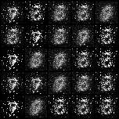
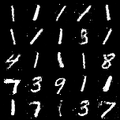
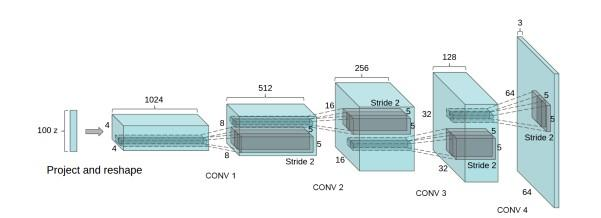

# 1.GAN架构及原理详解

## 1. 1GAN基本架构示意图


* 我们可以看到，GAN的网络架构十分简单，主要由**生成器G**(Generative Network)和**判别器D**(Discriminative Network)以及最后的损失函数组成
* 在训练过程中，**​生成器G的目标就是尽量生成真实的图片去欺骗判别器D。而D的目标就是尽量把G生成的图片和真实的图片分别开来。​**这样，G和D构成了一个动态的“博弈过程”。
* **​在最理想的状态下，​**G可以生成足以“以假乱真”的图片G(z)。对于D来说，它难以判定G生成的图片究竟是不是真实的，因此D(G(z))=0.5。
* 需要注意的是：**GAN的判别器和生成器不能同时训练**，GAN的变体也大致遵循这个特点

## 1.2 生成器

* 生成器架构：可以用全连接层，也可以用卷积（DCGAN）。代码里用**四层全连接层FC**，简单一点，但效果肯定没有卷积好
* 生成器的输入与输出：输入为一个**自设定维度（假设100）的垃圾特征向量（内容随意，可以随机初始化）**，通过几个全连接层以后**输出一个shape=（28，28，1）的张量（即一个单通道且为随机生成784像素点的图片）**,这个输出的**fake picture应该和real picture（ground truth）的shape相同**，所以需要在全连接层的最后一层**指定输出的维度**
* 生成器中的全连接层使用**leaky_relu**作为激活函数
* 数据流维度变化：100-128（第一层FC）,128-256（第二层FC）,256-512（第三层FC）,512-784(**784为real picture的像素点数量$28\times28\times1$**)（第四层FC）

```
# -----------------
        #  Train Generator
        # -----------------

        optimizer_G.zero_grad()

        # Sample noise as generator input
        z = Variable(Tensor(np.random.normal(0, 1, (imgs.shape[0], opt.latent_dim))))

        # Generate a batch of images
        gen_imgs = generator(z)

        # Loss measures generator's ability to fool the discriminator
        g_loss = adversarial_loss(discriminator(gen_imgs), valid)

        g_loss.backward()
        optimizer_G.step()
```

## 1.3 判别器

* 判别器架构：与生成器一样，使用**三层全连接层FC**
* 判别器输入与输出：
  1. 由于**判别器的功能是判别一张生成器给出的图片是fake还是real**，所以其输入应该是生成器所输出的**shape=（28，28，1）的fake picture**以及从数据集中取出的**shape=（28，28，1）的real picture**
  2. 一张图片应该**给出一个预测的概率输入到sigmoid损失函数中，所以判别器的输出是一个单一数值Prediction**
* 判别器中的全连接层使用**leaky_relu**作为激活函数。
* 数据流维度变化：784-512（第一层FC）,512-256（第二层FC）,256-1（1为prediction）（第三层FC）

```
# ---------------------
        #  Train Discriminator
        # ---------------------

        optimizer_D.zero_grad() # 梯度清0

        # Measure discriminator's ability to classify real from generated samples
        real_loss = adversarial_loss(discriminator(real_imgs), valid)
        fake_loss = adversarial_loss(discriminator(gen_imgs.detach()), fake)
        d_loss = (real_loss + fake_loss) / 2

        d_loss.backward()
        optimizer_D.step()
```

## 1.4 损失函数

### 1.4.1 损失函数介绍

* 输出的特征先通过sigmoid函数做scaling，然后输入到二分类损失函数BCEloss计算损失值，下图是BCEloss的方程
  

  1.$t[i]$为一张picture对应的标签valid(1)或fake(0)
  2.$o[i]$为一张图片由判别器输出的prediction值通过sigmoid函数进行scaling化后得出的，处在区间[0,1]内的一个特征值
  3.由于$o[i]$与$1-o[i]$都处在区间[0,1]内，所以求和符号内部求得为负数，故在求各样本平均损失值后应该添加符号
* BCEWithLogistLoss为：这个损失函数**直接在内部就通过sigmoids做scaling了，不需要自己在做了**，可以在gan.py以下代码中调整损失函数类别：
  `adversarial_loss = torch.nn.BCELoss() # torch.nn.BCEWithLogitsLoss`

### 1.4.2 生成器损失函数细节

* 生成器的损失函数为二分类损失函数BCEloss或BCEWithLogistLoss，输入为：**生成器吃入垃圾特征向量组以后输出的fake picture batch以及标签valid(1)**
* 标签是valid(1)的原因是：生成器的功能应是**输出的fake data应该被判别器看起来尽可能valid，以欺骗判别器**

### 1.4.3 判别器损失函数细节

* 判别器损失函数为二分类损失函数BCEloss或BCEWithLogistLoss，输入为:**生成器的输出fake picture batch&&数据集中取出的real picture batch**，所以其损失值由两部分组成：
  1.将real picture batch和标签valid(1)输入到BCEloss中得出real loss
  2.将fake picture batch和标签fake(0)输入到BCEloss中得出fake loss
  3.最后得出的总损失值为：(real loss+fake loss)/2
* real picture batch对应标签是valid(1)、fake picture batch对应标签是fake(0)的原因：判别器的功能应为**精准的将real data预测为valid、精准的将fake data预测为fake,以尽可能识别出生成器的骗术**

### 1.4.4 注意事项

* 生成器与判别器需要单独计算损失值，所以两个损失函数之间需要梯度清0

## 1.5 MNIST数据集

* 本项目采用MINIST数据集。MNIST 数据集来自美国国家标准与技术研究所, National Institute of Standards and Technology (NIST). 训练集 (training set) 由来自 250 个不同人手写的数字构成, 其中 50% 是高中学生, 50% 来自人口普查局 (the Census Bureau) 的工作人员. 测试集(test set) 也是同样比例的手写数字数据。
* MNIST数据集可在 [http://**yann.lecun.com/exdb/mni**st/](https://link.zhihu.com/?target=http%3A//yann.lecun.com/exdb/mnist/) 获取, 它包含了四个部分:
  1.Training set images: [train-images-idx3-ubyte.gz](https://link.zhihu.com/?target=http%3A//yann.lecun.com/exdb/mnist/train-images-idx3-ubyte.gz) (9.9 MB, 解压后 47 MB, 包含 60,000 个样本)
  2.Training set labels: [train-labels-idx1-ubyte.gz](https://link.zhihu.com/?target=http%3A//yann.lecun.com/exdb/mnist/train-labels-idx1-ubyte.gz) (29 KB, 解压后 60 KB, 包含 60,000 个标签)
  3.Test set images: [t10k-images-idx3-ubyte.gz](https://link.zhihu.com/?target=http%3A//yann.lecun.com/exdb/mnist/t10k-images-idx3-ubyte.gz) (1.6 MB, 解压后 7.8 MB, 包含 10,000 个样本)
  4.Test set labels: [t10k-labels-idx1-ubyte.gz](https://link.zhihu.com/?target=http%3A//yann.lecun.com/exdb/mnist/t10k-labels-idx1-ubyte.gz) (5KB, 解压后 10 KB, 包含 10,000 个标签)

## 1.6 注意事项：

* 本项目从数据集中拿real picture时是分成不同batch后逐batch取出，所以要输入生成器的垃圾特征向量组的个数应该与单个batch含的图片个数相同，其中每个向量的维度为100，采用高斯随机分布来初始化向量中每个数值。

## 1.7 结果展示

* 本项目在MNIST数据集上训练了300epoch，得出生成图像保存在images目录中，下面是一个对比样例，对比了训练前期和后期的生成图像：
  
  
  可见，在经过300epoch的训练后，生成器所生成的图像已经非常清晰易识别且无噪音

# 2.DCGAN架构

* DCGAN将CNN与GAN相结合，它只是把上述GAN中的G和D内部由全连接层FC换成了两个卷积神经网络（CNN），并对卷积神经网络的结构做了一些改变，以提高样本的质量和收敛的速度，这些改变有：
  1.取消所有pooling层。G网络中使用转置卷积（transposed convolutional layer）进行上采样，D网络中用加入stride（卷积步长）的卷积代替pooling。
  2.在D和G中均使用batch normalization
  3.去掉FC层，使网络变为全卷积网络
  4.G中使用ReLU作为激活函数，最后一层使用tanh
  5.D中使用LeakyReLU作为激活函数
* DCGAN的网络示意图：
  

